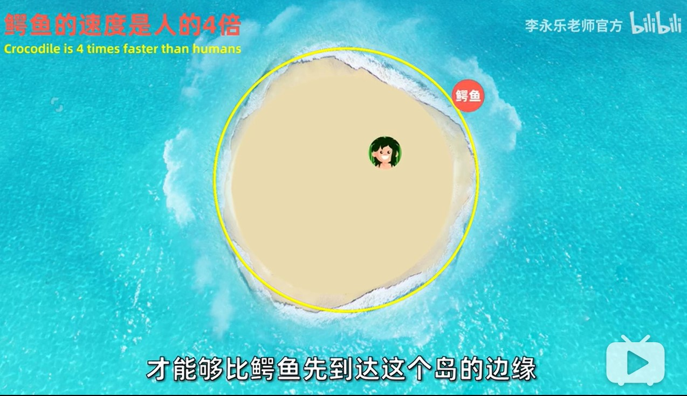
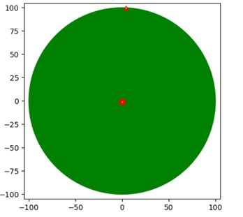
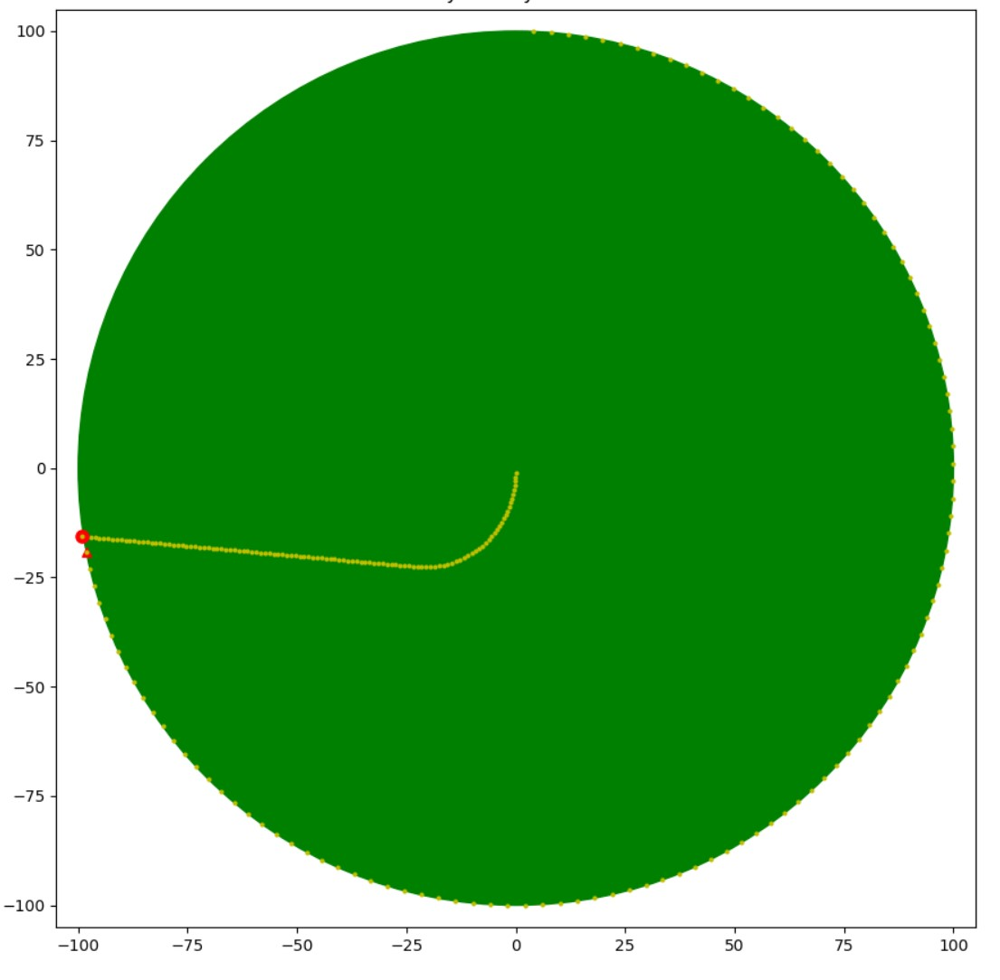

**关键词:**
[TOC]

# 题目
李永乐老师在视频末尾提出了一个问题: 
> 假如有一个圆形的小岛，有一条鳄鱼在圆形小岛上游弋，鳄鱼速度是人的四倍，鳄鱼总是希望找到离人最近的位置，而这个人最开始在这个小岛的正中心，那么这个人应该如何运动，才能比鳄鱼先到达这个岛的边缘，从而逃离这个岛呢？
[复工复产找工作？先来看看这道面试题：双蛋问题_哔哩哔哩 (゜-゜)つロ 干杯~-bilibili](https://www.bilibili.com/video/BV1KE41137PK?from=search&seid=1179412664686887799)



# 解题思路
人(小明)逃离的本质是, 达到岸边的时间比鳄鱼少. 
假设小明每秒迈出一步, 每一步迈出左脚还是右脚不重要, 迈出的方向很重要; 
每一步都以岸边的某个位置为终点方向, 如果直线运动到该位置, 小明所用时间和鳄鱼所用之间之比最大, 就说明该方向是这一步的最佳方向; 
如果每一步都是最佳方向, 那么就应该是达到岸边的最优解; 
如何确定每一步的最佳方向呢? 暴力计算, 用程序计算每个方向的时间比, 取最大值; 

# 数学模型
建立直角坐标系, 岛屿是一个圆, 圆心在原点; 小明的位置用直接坐标系表示, 鳄鱼的位置用极坐标表示; 


- 如何计算每一步的最佳方向?
    - 遍历圆上的点, 计算时间比
	- 由于速度确定, 时间比简化为距离比
- 如何计算小明到岸边的距离?
    - 直线距离, 直接用公式计算
- 如何计算鳄鱼到岸边某位置的距离?
    - 鳄鱼采用极坐标, 通过圆心角乘以半径计算出距离
- 如何计算人移动后的位置?
    - 向量平移
- 如何计算鳄鱼移动后的位置?
    - 极坐标, 增加角度;

# 代码实现
代码:   
gitee: [python暴力计算鳄鱼岛问题](https://gitee.com/qiaoxingxing/eyudao/blob/master/main.py)  
github: [python暴力计算鳄鱼岛问题](https://github.com/qiaoxingxing/eyudao/blob/master/main.py)  

最终的效果: 


## 使用方式
python 版本: 3.7  
安装依赖: 
```
pip install -r requirements.txt
```
运行: 
```
python main.py
```
弹出窗口, 按住空格键; 

# 结果验证
从代码运行的结果上看, 后半段是直线运行的; 和这里的结论是相同的:  

[【路线求解】甩开鳄鱼，逃离孤岛，李永乐老师面试题解答_哔哩哔哩 (゜-゜)つロ 干杯~-bilibili](https://www.bilibili.com/video/BV1R741117LT?p=2)

